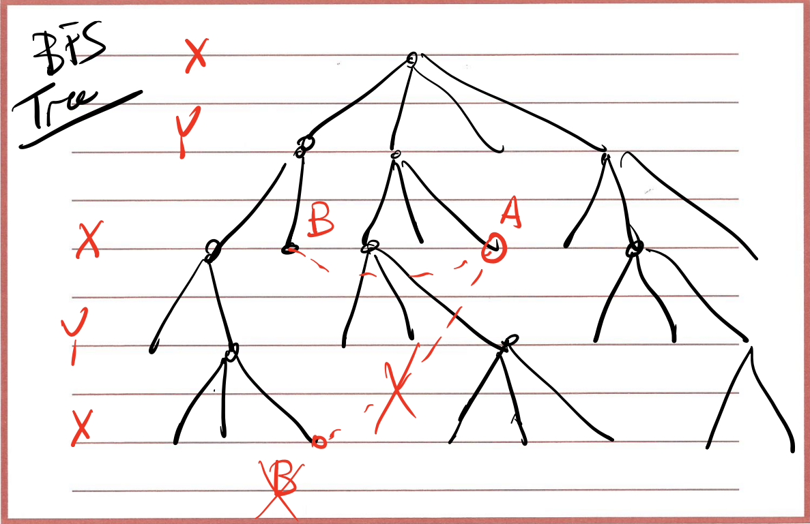

# Asymptotic notation & BFS\DFS

- [1. Asymptotic Notation](#1-asymptotic-notation)
  - [(a) O(n) : Upper Bound](#a-on--upper-bound)
  - [(b) Ω(n) : Lower Bound](#b-ωn--lower-bound)
  - [(c) θ(n) : Tight Bound](#c-θn--tight-bound)
- [2. Worst Case Performance](#2-worst-case-performance)
  - [(a) Compare](#a-compare)
  - [(b) Hybrid](#b-hybrid)
- [3. Breadth-First & Depth-First Search](#3-breadth-first--depth-first-search)
  - [(a) What are we searching for](#a-what-are-we-searching-for)
  - [(b) BFS](#b-bfs)
  - [(b) DFS](#b-dfs)
- [4. How to use BFS & DFS](#4-how-to-use-bfs--dfs)
  - [(a)Determine a Bipartite Graph](#adetermine-a-bipartite-graph)
    - [(i) Definition of Bipartite](#i-definition-of-bipartite)
    - [(ii) BFS Solution](#ii-bfs-solution)
  - [(b) Determine a Strong Connected Graph](#b-determine-a-strong-connected-graph)
    - [(i) Definition of Strong Connected](#i-definition-of-strong-connected)
    - [(ii) Brute Force Solution](#ii-brute-force-solution)
    - [(iii) Mutually Reachable Solution](#iii-mutually-reachable-solution)

## 1. Asymptotic Notation

### (a) O(n) : Upper Bound

**O(g(n))** : There exist positive constant **c and n0** such that **0 ≤ f(n) ≤ cg(n) for all n ≥n0**

### (b) Ω(n) : Lower Bound

**Ω(g(n))** : There exist positive constant **c and n0** such that **0 ≤ cg(n) ≤ f(n) for n ≥n0**

### (c) θ(n) : Tight Bound

**θ(g(n))** : There exist positive constant **c1 and c2 and n0** such that **0 ≤ c1g(n) ≤ f(n) ≤ c2g(n)  for n ≥n0**

## 2. Worst Case Performance

### (a) Compare

Exponential Component > Polynomial Component > Logarithmic Component 

### (b) Hybrid

The hybrid of tow algorithm (like the merge sort and insertion sort) is possible

## 3. Breadth-First & Depth-First Search

### (a) What are we searching for

Find out if there is a path from A to B

Find all nodes that can be reached from A

### (b) BFS

Breadth-first search (BFS) is an algorithm for searching a tree data structure for a node that satisfies a given property. It starts at the tree root and explores all nodes at **the present depth** prior to moving on to the nodes at the next depth level. 

**Nodes at same level share the same distance from the starting point(source).**

After reaching to the end do **1 level Back up**

**Worst Case Performance O(m+n)**

**m = number of edges**

**n = number of nodes**

### (b) DFS

Depth-first search (DFS) is an algorithm for traversing or searching tree or graph data structures. The algorithm starts at the root node (selecting some arbitrary node as the root node in the case of a graph) and explores as far as possible along each branch before backtracking.

**Nodes at same level share the same distance from the starting point(source).**

**Worst Case Performance O(m+n)**

**m = number of edges**

**n = number of nodes**

## 4. How to use BFS & DFS

### (a)Determine a Bipartite Graph

#### (i) Definition of Bipartite

In the mathematical field of graph theory, a **bipartite graph** (or bigraph) is a graph whose vertices can be divided into **two disjoint and independent sets** U and V such that every edge connects a vertex in U to one in V. Vertex sets  U and V are usually called the parts of the graph. 

**If a graph is bipartite, it cannot have an odd cycle.**

#### (ii) BFS Solution

1. Run BFS starting from any node, Say S. Label each node **Red or Blue** depending on whether they appear at an odd or even level on the BFS Tree. **---- O(m+n)**

2. Then, go through all edges and examine the label at the two end of the edge. If all edges have **a Red and a Blue end.** Hence the graph is bipartite. Otherwise, the graph is not bipartite. **---- O(m)**

Overall time complexity: **O(m+n)**

### (b) Determine a Strong Connected Graph

#### (i) Definition of Strong Connected

A directed graph is strongly connected if there is a **path from any point to any other point** in the graph

#### (ii) Brute Force Solution

Run BFS/DFS from each node ---- **O(n2 + nm)** 

#### (iii) Mutually Reachable Solution

1. Use BFS/DFS to find all nodes reachable from S (an arbitrary node) in G. If some nodes are not reachable from S, Stop. The graph is not strongly connected ---- **O(n +m)**

2. Create GT (Transpose of G) ---- **O(n +m)**

   **Adjacency List representation space complexity** **= O(n +m)**

3. Use BFS/DFS to fins all nodes reachable from S in GT, If some nodes are not reachable from S, Stop. The graph is not strongly connected ---- **O(n +m)**

Overall time complexity: **O(m+n)**

