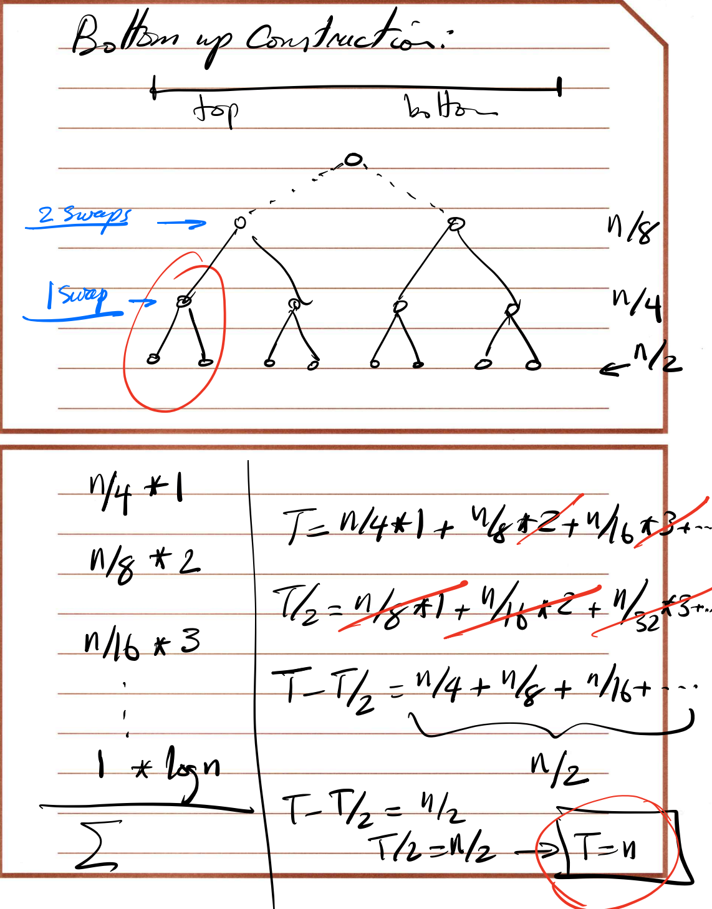

# Greedy Algorithm
- [1. Interval Scheduling Problem](#1-interval-scheduling-problem)
  - [(a) Problem Description](#a-problem-description)
  - [(b) Several Failed Attempt](#b-several-failed-attempt)
  - [(c) Solution](#c-solution)
  - [(d) Proof of Correctness](#d-proof-of-correctness)
    - [(i) Show that A is a compatible Set](#i-show-that-a-is-a-compatible-set)
    - [(ii) Show that A is an optimal set](#ii-show-that-a-is-an-optimal-set)
  - [(e) Implementation & Complexity](#e-implementation--complexity)
- [2. Scheduling to Minimize Lateness](#2-scheduling-to-minimize-lateness)
  - [(a) Problem Description](#a-problem-description-1)
  - [(b) Several Failed Attempt](#b-several-failed-attempt-1)
  - [(c) Solution](#c-solution-1)
  - [(d) Proof of Correctness](#d-proof-of-correctness-1)
    - [(i) There is an optimal solution with no gaps](#i-there-is-an-optimal-solution-with-no-gaps)
    - [(ii) Jobs with identical deadline can be scheduled in any order without affecting Maximum Lateness](#ii-jobs-with-identical-deadline-can-be-scheduled-in-any-order-without-affecting-maximum-lateness)
    - [(iii) All schedules with no inversion and no idle time have the same maximum Lateness](#iii-all-schedules-with-no-inversion-and-no-idle-time-have-the-same-maximum-lateness)
    - [(iV) There is an optimal schedule that has no inversion and no idle time](#iv-there-is-an-optimal-schedule-that-has-no-inversion-and-no-idle-time)
    - [(V) Summary](#v-summary)
- [3. Priority Queue](#3-priority-queue)
  - [(a) Problem Description](#a-problem-description-2)
  - [(b) Binary Tree & Binary Heap](#b-binary-tree--binary-heap)
    - [(i) Binary Tree](#i-binary-tree)
    - [(ii) Binary Heap](#ii-binary-heap)
  - [(c) Implementation & Complexity](#c-implementation--complexity)

## 1. Interval Scheduling Problem

### (a) Problem Description

**Input:** Set of request {1,2....n}

ith request starts at s(i) and ends at f(i)

**Objective:** To find the **largest compatible subset** of these requests

### (b) Several Failed Attempt

1. Earliest Start Time
2. Smallest Request First
3. Smallest Number of Overlap First
4. Earliest Finish Time

### (c) Solution

Initially R is the complete set of request and A is empty

While R is not empty

​	Choose a request i∈R that has the **smallest finish time**

​	Add request i to A

​	**Delete all request** from R that are **not compatible with i**

End while

Return A

### (d) Proof of Correctness

#### (i) Show that A is a compatible Set

Delete all requests that are not compatible with A could proof it

#### (ii) Show that A is an optimal set

**First we need to prove that for all indices r ≤ k, we have f(ir) ≤ f(jr)**

**Mathematical Induction: 数学归纳法**

Base Case: f(i1) ≤ f(j1)

if jl+1 is compatible with jl , then jl+1 must compatible with il

il+1 is compatible with il and have the earliest time

so we have f(il+1) ≤ f(jl+1)

**Second we need to proof |A| = |O|**

If there was a jk+1 out there, then it is must compatible with il , then it will be picked by A

### (e) Implementation & Complexity

Sort request in **order of finish time** and label in their order **---- O(nlogn)**

Select request in order of increasing f(ii), always selecting the first. Then iterate through the intervals in their order **---- O(n)**

**Overall Complexity = O(nlogn)**

## 2. Scheduling to Minimize Lateness

### (a) Problem Description

Request can be scheduled at any time

Each request has a deadline

Notation: Li = f(i) - d(i)

Li is called lateness for request i

**Goal: Minimize the Maximum Lateness L**

### (b) Several Failed Attempt

1. Smallest msg First
2. Smallest Slack First

### (c) Solution

Schedule jobs in order of their deadline without any gaps between jobs

### (d) Proof of Correctness

#### (i) There is an optimal solution with no gaps

remove the gap is safe

#### (ii) Jobs with identical deadline can be scheduled in any order without affecting Maximum Lateness

The lateness if fixed

#### (iii) All schedules with no inversion and no idle time have the same maximum Lateness

Def: 

Schedule A' Has an inversion if job i with deadline di is scheduled before job j with **earliest deadline**

#### (iV) There is an optimal schedule that has no inversion and no idle time

- If there is an inversion between a & b, then there must be an inversion **between 2 adjacent nodes** among them(in this case, z & b)
- Swap the inversion is safe, Li after the swap will not be larger than the maximum Lateness before Swap

#### (V) Summary

Proved that there exists an optimal schedule with no inversion and no idle time

Also proved that all schedules with on inversion and no idle time have same maximum lateness

Our greedy algorithm produced on such solution ->  It will be optimal

## 3. Priority Queue

### (a) Problem Description

A priority queue has to perform these two operation fast

1. Insert an element in to the set
2. Find the smallest element in the set

<table align=center style='text-align:center;' >  
    <tr>    
        <th></th>    
        <th>Insert</th>    
        <th>Find-Min</th>
    </tr>
    <tr>    
        <td >Array Implementation</td>    
        <td >O( 1 )</td>    
        <td >O( n )</td>  
    </tr>
    <tr>    
        <td>Sorted Array</td>    
        <td>O( n )</td>    
        <td>O( 1 )</td>  
    </tr>
    <tr>    
    <td >Linked List</td>    
    <td >O( 1 )</td>    
    <td >O( n )</td>    
	</tr>
    <tr>    
    <td >Sorted Linked List</td>    
    <td >O( n )</td>    
    <td >O( 1 )</td>
	</tr>
</table>

I**nput: An unsorted array of length n**

**Output: Top k values in the array (k<n)**

Constraints:

- You cannot use any additional memory
- Find an algorithm that runs in line

### (b) Binary Tree & Binary Heap

#### (i) Binary Tree

A binary tree is a tree data structure in which each node has at most two children, which are referred to as the *left child* and the *right child*.

A binary tree of depth k which has exactly 2k-1 nodes is called a **full binary tree**. A binary tree with n nodes and of depth k is complete if its nodes correspond to the nodes which are numbered 1 to n in the full binary tree of depth k

#### (ii) Binary Heap

A binary heap is a complete binary tree with the property that the value(of the key) at each node is at least as large as the value as its children **(Max Heap)**

<table align=center style='text-align:center;' >  
    <tr>    
        <th></th>    
        <th>Binary Heap</th>    
        <th>Binominal Heap</th>
        <th>Fibonacci Heap</th>
    </tr>
    <tr>    
        <td >Find-Min</td>    
        <td >O( 1 )</td>    
        <td >O( Log(n) )</td> 
        <td >O( 1 )</td>  
    </tr>
    <tr>    
        <td>Insert</td>    
        <td>O( Log(n) )</td>    
        <td>O( Log(n) )</td>  
        <td >O( 1 )</td>  
    </tr>
    <tr>    
    <td >Extract-Min</td>    
    <td >O( Log(n) )</td>    
    <td >O( Log(n) )</td>  
    <td >O( Log(n) )</td>    
	</tr>
    <tr>    
    <td >Delete</td>    
    <td >O( Log(n) )</td>    
    <td >O( Log(n) )</td>
    <td >O( Log(n) )</td>
	</tr>
    <tr>    
    <td >Decerease-Key</td>    
    <td >O( Log(n) )</td>    
    <td >O( Log(n) )</td> 
    <td >O( 1 )</td>
	</tr>
    <tr>    
    <td >Merge</td>    
    <td >O( Log(n) )</td>    
    <td >O( Log(n) )</td>
    <td >O( 1 )</td>
	</tr>
    <tr>    
    <td >Construct</td>    
    <td >O( n )</td>    
    <td >O( n )</td>
    <td >O( n )</td>
	</tr>
</table>

### (c) Implementation & Complexity

1. Constructions of heap **---- O(k)**

2. Going through the rest of n-k values **---- O( (n-k)logk )** 

Overall complexity = **O( nlogk )**

