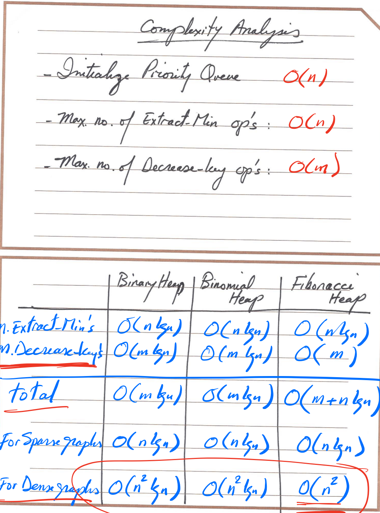

# Heap
- [1. Binominal & Fibonacci](#1-binominal--fibonacci)
  - [(a)  Binominal Tree & Binominal Heap](#a--binominal-tree--binominal-heap)
    - [(i) Binominal Tree](#i-binominal-tree)
    - [(ii) Binominal Heap](#ii-binominal-heap)
  - [(b) Fibonacci Tree & Fibonacci Heap](#b-fibonacci-tree--fibonacci-heap)
    - [(i) Fibonacci Tree](#i-fibonacci-tree)
    - [(ii) Fibonacci heap](#ii-fibonacci-heap)
  - [(c) Time Complexity](#c-time-complexity)
- [2. Amortized Cost Analogies](#2-amortized-cost-analogies)
  - [(a) Problem of Multipop](#a-problem-of-multipop)
  - [(b) Aggregate Analysis 综合分析](#b-aggregate-analysis-综合分析)
  - [(c) Accounting Method](#c-accounting-method)
- [3. Shortest Path Problem](#3-shortest-path-problem)
  - [(a) Problem Description](#a-problem-description)
  - [(b) Solution & Dijkstra's Algorithm](#b-solution--dijkstras-algorithm)
  - [(c) Proof of Correctness](#c-proof-of-correctness)
  - [(d) Implementation & Complexity](#d-implementation--complexity)
- [4. Minimum Cost Problem](#4-minimum-cost-problem)
  - [(a) Problem Description](#a-problem-description-1)
    - [(i) Spanning Tree](#i-spanning-tree)
    - [(ii) Minimum Spanning Tree - MST](#ii-minimum-spanning-tree---mst)
  - [(b) Solutions](#b-solutions)
    - [(i) Kruskal's Algorithm](#i-kruskals-algorithm)
    - [(ii) Prim's Algorithm](#ii-prims-algorithm)
    - [(iii) Reverse_Delete Algorithm](#iii-reverse_delete-algorithm)

## 1. Binominal & Fibonacci

### (a)  Binominal Tree & Binominal Heap

#### (i) Binominal Tree

- A binominal tree Bk is an ordered tree defined recursively

- Binominal tree B0 consist of one node

- Binomial tree Bk consist of 2 Bk-1 that are linked together such that the root of one is the **leftmost child of** the **root of the other**

#### (ii) Binominal Heap

A Binominal heap is a set of binominal tree that satisfy the following properties

- Each binominal tree  in H obeys the **min-heap property**
- For any non-negative integer k, there is **at most one Binominal  tree in H** whose root has degree k

### (b) Fibonacci Tree & Fibonacci Heap

#### (i) Fibonacci Tree

the Fibonacci sequence, in which each number is the sum of the two preceding ones.

#### (ii) Fibonacci heap

a Fibonacci heap is a data structure for **priority queue operations**, consisting of a collection of **heap-ordered trees**. It has a **better amortized running time** than many other priority queue data structures including the binary heap and binomial heap. 

### (c) Time Complexity

<table align=center style='text-align:center;' >  
    <tr>    
        <th></th>    
        <th>Binary Heap</th>    
        <th>Binominal Heap</th>
        <th>Fibonacci Heap</th>
    </tr>
    <tr>    
        <td >Find-Min</td>    
        <td >O( 1 )</td>    
        <td >O( Log(n) )</td> 
        <td >O( 1 )</td>  
    </tr>
    <tr>    
        <td>Insert</td>    
        <td>O( Log(n) )</td>    
        <td>O( Log(n) )</td>  
        <td >O( 1 )</td>  
    </tr>
    <tr>    
    <td >Extract-Min</td>    
    <td >O( Log(n) )</td>    
    <td >O( Log(n) )</td>  
    <td >O( Log(n) )</td>    
	</tr>
    <tr>    
    <td >Delete</td>    
    <td >O( Log(n) )</td>    
    <td >O( Log(n) )</td>
    <td >O( Log(n) )</td>
	</tr>
    <tr>    
    <td >Decerease-Key</td>    
    <td >O( Log(n) )</td>    
    <td >O( Log(n) )</td> 
    <td >O( 1 )</td>
	</tr>
    <tr>    
    <td >Merge</td>    
    <td >O( Log(n) )</td>    
    <td >O( Log(n) )</td>
    <td >O( 1 )</td>
	</tr>
    <tr>    
    <td >Construct</td>    
    <td >O( n )</td>    
    <td >O( n )</td>
    <td >O( n )</td>
	</tr>
</table>

## 2. Amortized Cost Analogies

### (a) Problem of Multipop

If do pop n times and do multipop, the cost will be O( n )

### (b) Aggregate Analysis 综合分析

We show that a sequence of n operations tales worst-case time T(n) total

So in the worst case, the amortized cost(average cost) per operation will be T(n)/n

Observation: 

Multipop takes O( n ) time if there are n element pushed on the stack.

A sequence of n pushes takes O( n ), multipop takes O( n ).

When amortized over n operations, average cost of an operation = **O( n )/n = O( 1 )**

### (c) Accounting Method

- We assign different charges to different operation

- If the charge for an operation exceeds its actual cost, the excess is stored in credit

- The credit can later help pay for operation whose actual cost is higher than their actual cost

- Total credit at any time = total amortized cost - total actual cost

- Total credit can never be negative

## 3. Shortest Path Problem

### (a) Problem Description

Given G=(V,E) with W(u,v) ≥ 0, for each edge (u,v)  ∈ E, Find the shortest path from s ∈ V to V-s

### (b) Solution & Dijkstra's Algorithm

1. Start with a set S of vertices whose final shortest path we already know
2. At each step, find a vertex u ∈ V-s with shortest distance from S
3. Add u to S and repeat

### (c) Proof of Correctness

We will proof that at each step, Dijkstra's algorithm find the shortest path to a new node in the grapgh

Mathematical Induction:

### (d) Implementation & Complexity

## 4. Minimum Cost Problem

### (a) Problem Description

Find minimum cost network that connect all nodes in G (undirected graph)

#### (i) Spanning Tree

Any tree that covers all nodes of a graph is called a spanning tree

#### (ii) Minimum Spanning Tree - MST

A spanning tree with minimum total edge cost is a minimum spanning tree

### (b) Solutions

#### (i) Kruskal's Algorithm

Sort all edges in increasing order of cost. Add edges to T in their order as long as ti does not create a cycle. If it does, discard the edge.

#### (ii) Prim's Algorithm

Similar to Dijkstra's algorithm, start with a node set S (initially the root node) no which a minimum spanning tree has been construted so far. At each step, grow S by one node, adding the node v that minimizes the attachment cost.

#### (iii) Reverse_Delete Algorithm

Backward version of Kruskal's algorithm. Start with a full graph (V,E). Begin deleting edges in order of decereasing cost as long as it does not disconnect the graph.

