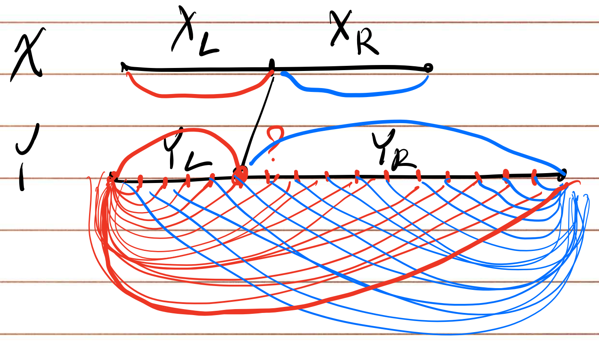
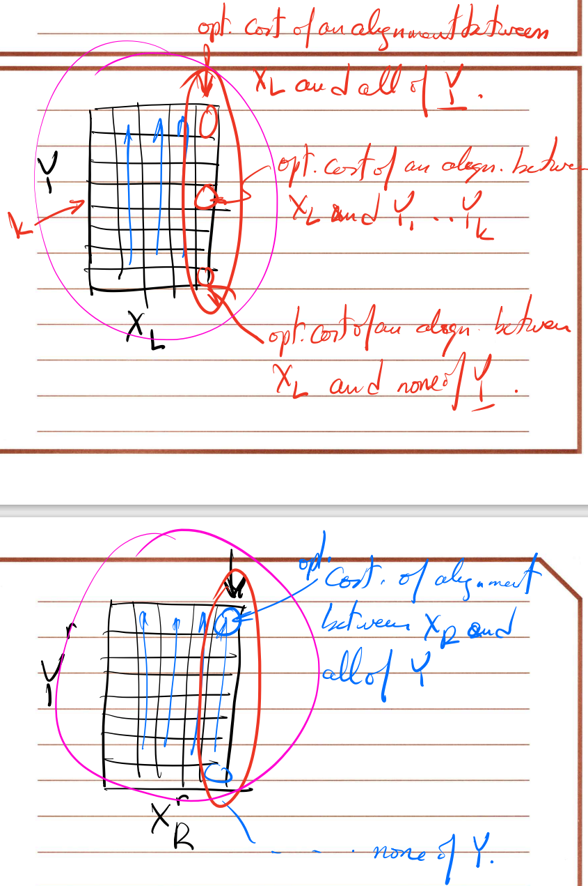
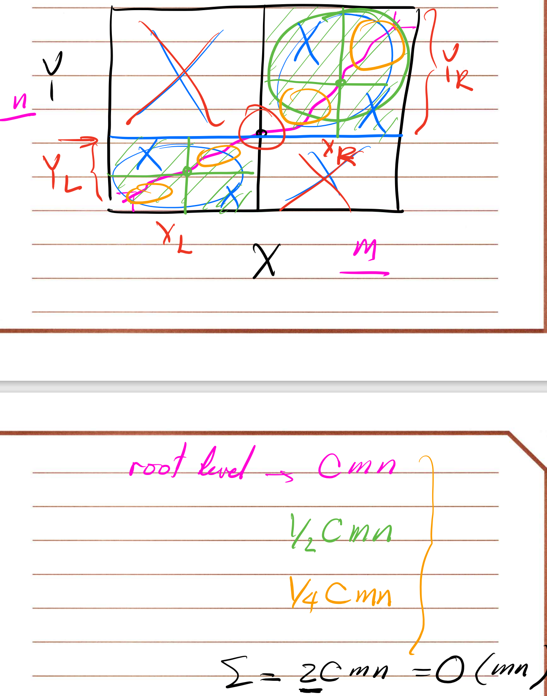

# Dynamic Programming


## 3. Sequence Alignment

### 3.1 Definition

#### a.  Matching

A Matching is a set of **ordered pairs** with property that each item occurs at most once

A Matching is an alignment if there are **no crossing pairs**

#### b. Gap penalty & Mismatch penalty

We incur a **gap penalty of δ** for each gap.

For each mismatch (of letters p&q) we incur a **mismatch cost α<sub>pq</sub>** .

#### c. Similarity

The minimum cost of an alignment between String X & Y

### 3.2 Definition of OPT

Define OPT(i, j) as the **minimum cost of an alignment** between x1...xi & y1...yj

### 3.3 Optimal Solution

In an **optimal solution M**, at least one of the following is true

**If (X<sub>m</sub>, Y<sub>n</sub>) ∈ M**

<div align=center></div>

**If X<sub>m</sub> is not matched**

<div align=center></div>

**If Y<sub>n</sub> is not matched**

<div align=center></div>

```java
OPT(i, j) = Min[OPT(i-1,j-1) + αij, OPT(i-1,j) + δ, OPT(i,j-1) + δ]
```

### 3.4 Run Time Complexity

```python
for i = 1 to m		## m time
	for j = 1 to n	## n time
		Formular above ## 1 time
	end for
end for
```

O(mn) : polynomial -> inefficient solution

### 3.5 More Efficient Approach(Divide & Conquer)

We will try to find the cost of **X<sub>L</sub> with Y<sub>0</sub> to Y<sub>n</sub>**

Then do the symmetric to find  the cost of **X<sub>R</sub> with Y<sub>n</sub> to Y<sub>0</sub>**

Add them up and find the minimum cost

Draw the table, we only need the **top right column**

Do it recursively 

We save **1/2 memory** with only 2 times of earlier time complexity

<div align=center></div>

<div align=center></div>

<div align=center></div>


