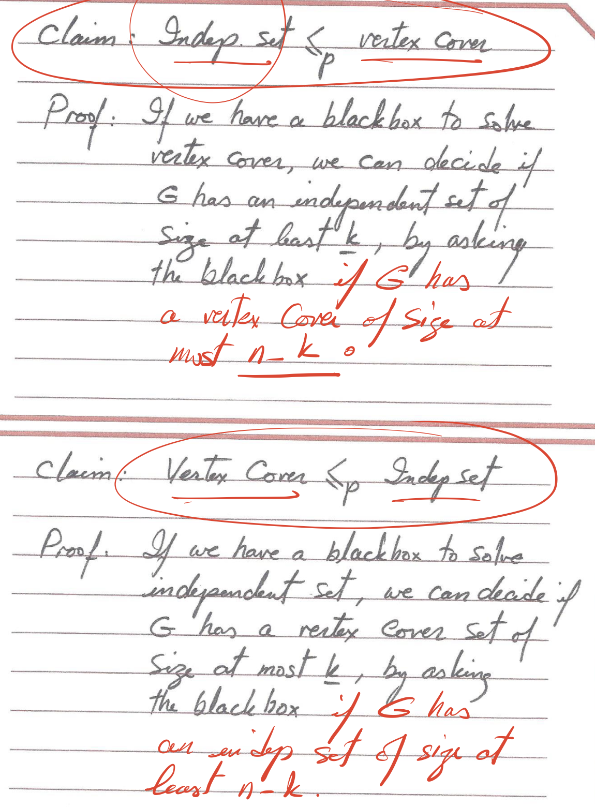
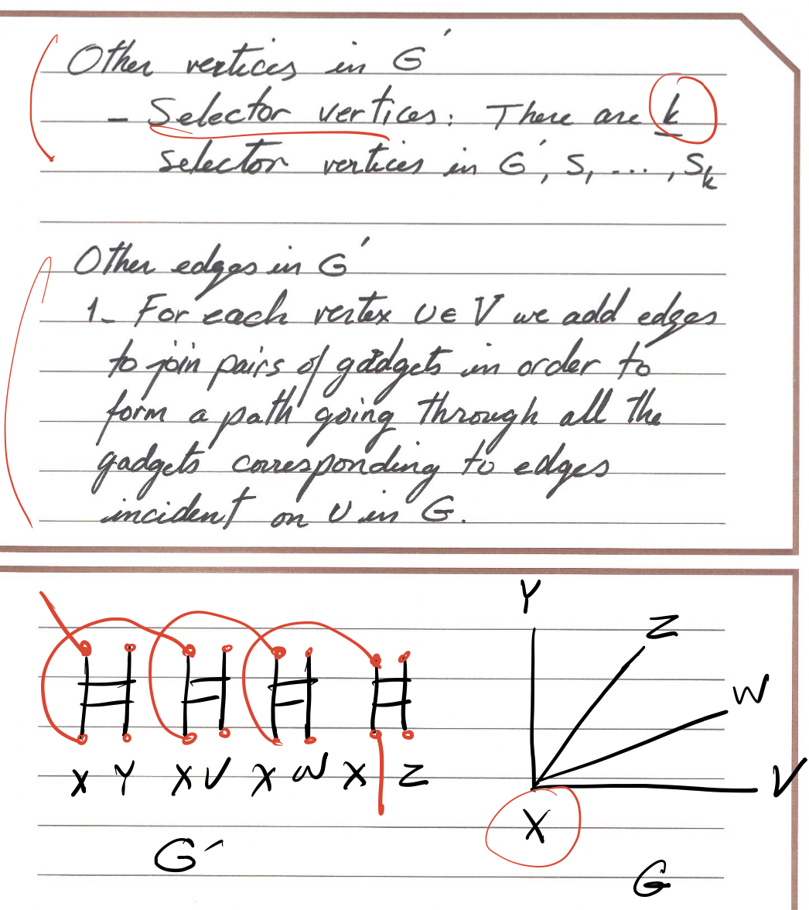

# NP and Computational Tractability

- [1. How to Measure](#1-how-to-measure)
- [2. Polynomial Reducible](#2-polynomial-reducible)
- [3. Independent & Vertex](#3-independent--vertex)
  - [3.1 Definition](#31-definition)
  - [3.2 Optimization & Decision](#32-optimization--decision)
  - [3.3 Relationship](#33-relationship)
    - [(a). Compliment](#a-compliment)
    - [(b). Independent set ≤P Vertex Cover](#b-independent-set-p-vertex-cover)
    - [(c). Vertex Cover ≤P Independent set](#c-vertex-cover-p-independent-set)
- [4. Set Cover Problem](#4-set-cover-problem)
  - [4.1 Definition](#41-definition)
  - [4.2  Vertex Cover ≤P Set Cover](#42--vertex-cover-subpsub-set-cover)
- [5. Satisfiability Problem](#5-satisfiability-problem)
  - [5.1 Gadgets](#51-gadgets)
  - [5.2 Clause & SAT](#52-clause--sat)
  - [5.3. 3SAT  ≤P Independent Set](#53-3sat--subpsub-independent-set)
- [6. Efficient Certification](#6-efficient-certification)
  - [6.1 Definition](#61-definition)
  - [6.2 Certification of 3SAT & Independent Set](#62-certification-of-3sat--independent-set)
- [7. NP (Nondeterministic polynomial time)](#7-np-nondeterministic-polynomial-time)
  - [7.1 NP Class](#71-np-class)
  - [7.2 NP-Complete](#72-np-complete)
  - [7.3Transitivity](#73transitivity)
  - [7.3 Prove NP](#73-prove-np)
- [8.Traveling Salesman Problem (TSP)](#8traveling-salesman-problem-tsp)
  - [8.1 Problem Statement (OPT Version)](#81-problem-statement-opt-version)
  - [8.2 Decision Version of TSP](#82-decision-version-of-tsp)
  - [8.3 Prove TSP is NP-Complete](#83-prove-tsp-is-np-complete)
- [9. Hamiltonian Cycle](#9-hamiltonian-cycle)
  - [9.1 Problem Statement](#91-problem-statement)
  - [9.2 Steps to show HC is in NP-Complete](#92-steps-to-show-hc-is-in-np-complete)
  - [9.3 Prove HC is NP-Complete](#93-prove-hc-is-np-complete)
    - [(a) Plan](#a-plan)
    - [(b) Construction of G' through Gadget](#b-construction-of-g-through-gadget)
    - [(c) Proof of Vertex Cover & HC](#c-proof-of-vertex-cover--hc)
- [10. General NP-Complete Problem](#10-general-np-complete-problem)
  - [10.1 Decision Version of 0-1 Knapsack](#101-decision-version-of-0-1-knapsack)
  - [10.2 Triangle Inequaliztion](#102-triangle-inequaliztion)
## 1. How to Measure	

Plan:

Explore the **space of computationally hard problem** to arrive at a mathematical characterization of a large class of them.

Technique:

Compare **relative difficulty** of different problems

## 2. Polynomial Reducible

**Y ≤P X (Y is polynomial time reducible to X)**

*If Y can be solved using polynomial number of **standard computational steps** (steps that could be completed in fixed number of CPU cycle, eg, construction of the flow network) plus a polynomial number of call to a blackbock that solves X*

If problem X is at least as hard as problem Y, it means that if we could solve X, we could also solve Y.

Suppose Y ≤P X, if X can be solved in polynomial time, then Y can be sloved in polymial time

Suppose Y ≤P X, if Y cannot be solved in polynomial time, then X cannot be sloved in polymial time 

## 3. Independent & Vertex

### 3.1 Definition

In a graph G = (V, E), we say that a set of nodes S is a **Independent Set** if no two nodes in S are joined by an edge

Given a graph G = (V, E), we say that a set of nodes S is a **Vertex Cover** if every edge in E has at least one endpoint in S(each node connect at least another one in S)

### 3.2 Optimization & Decision

**Optimization version:**

Find the largest independent set in graph G

Find the smallest vertex cover set in graph G

**Decision version:**

Given a graph G, and a number K, dose G contain an independent set of size at least K?

Given a graph G, and a number K, dose G contain an vertex Cover of size at most K?

### 3.3 Relationship

#### (a). Compliment

**Let G = (V, E) be a graph, then S is an independent set of and only of its complement V-S is a Vertex Cover set.**

Proof:

#### (b). Independent set ≤P Vertex Cover

#### (c). Vertex Cover ≤P Independent set

Proved by the above method

## 4. Set Cover Problem

### 4.1 Definition

Given a set U of ne element, a collection S1,S2,....,Sm of m subsets of U, and a number of k. Dose that exist a collection of at most k of these sets whose union is equal to all of U

### 4.2  Vertex Cover ≤P Set Cover

Proof:

## 5. Satisfiability Problem
### 5.1 Gadgets
 A gadget is a subset of a problem instance that simulates the behavior of one of the fundamental units of a different computational problem

### 5.2 Clause & SAT 

**SAT:**

Given a set of clauses C1,...,Ck over a set of variable X={x1,...x,}, does this exist a satisfying truth assignment

**3SAT:**

Given a set of clauses C1,...,Ck each of legnth 3 over a set of variable X={x1,...x,}, does this exist a satisfying truth assignment

**Clause & Truth Assignment:**

### 5.3. 3SAT  ≤P Independent Set

## 6. Efficient Certification

### 6.1 Definition

Polynomial Length certificate (solution)

Polynomial time certifier (Algorithm)

### 6.2 Certification of 3SAT & Independent Set

3SAT:

**Certificate:**

Certificate t is an assignment of truth values to variable(xi)

**Certificer:**

Evaluate the clauses: if all of them evaluate to 1 then it answers yes

Independent Set:

**Certificate:**

Certificate t is a set of nodes of size at least k in G

**Certificer:**

Check each edge to make sure **no edges have both ends in the set**

Check **size of the set ≥ k**

Check **no repeating nodes**

## 7. NP (Nondeterministic polynomial time)

### 7.1 NP Class

Class NP is the set of all problems for which there exists an efficient Certifier

### 7.2 NP-Complete

If X belongs to NP and for all Y belongs to NP, Y ≤P X, then X is the hardest problem in NP

3SAT has been proven to be such a problem.

### 7.3Transitivity

### 7.3 Prove NP

## 8.Traveling Salesman Problem (TSP)

### 8.1 Problem Statement (OPT Version)

Given the set of distances **(fully connected graph)**, order n cities in a tour vi1, vi2,..., vin with i1 = 1.

To minimize ∑ d(vij, v(ij+1)) + d(vin, vi1)

### 8.2 Decision Version of TSP

Given a set of distance on n cities and a bound D, is there a tour of Length/Cost at most D 

To solve this problem we need to use the Hamiltonian Cycle

### 8.3 Prove TSP is NP-Complete

1. Show that TSP is NP

   a. Certificate

   ​	a tour of cost at most D

   b. Certifer

   ​	All checks we did for Hamiltonian Cycle'

   ​	Check that cost of tour ≤ D

2. Choose an NP-Complete Problem

   Hamiltonian Cycle

3. Prove that HC ≤P TSP

## 9. Hamiltonian Cycle

A cycle C in G is a Hamiltonian cycle if it visits each vertex exactly once

### 9.1 Problem Statement

Given an undirected graph G, is there a Hamiltonian cycle in G

### 9.2 Steps to show HC is in NP-Complete

1. Show that HC is in NP

   a. Polynomial length certificate

   ​	**Ordered list of nodes in G that forms a HC**

   b. polynomial time certifier

   ​	**Check that every node in the list & no node is repeated**

   ​	**Check that there is an edge between:**

   ​		**every pairs of adjacent nodes in the list**

   ​		**Last node & First node**

   a and b can easy be done in polynomial time ->  HC is NP

2. Chose a problem that we already know is NP-Complete 

   **Vertex cover**

3. Show vertex cover ≤P HC

### 9.3 Prove HC is NP-Complete

#### (a) Plan

Given an undirected graph G = (V, E) and an integer k, we construct G' = (V', E') that has a **Hamiltonian cycle** if and only if G has a **vertex cover** of **size at most k**

#### (b) Construction of G' through Gadget

#### (c) Proof of Vertex Cover & HC

## 10. General NP-Complete Problem

### 10.1 Decision Version of 0-1 Knapsack

### 10.2 Triangle Inequaliztion

2-approximation 

### 10.3 General TSP

f
