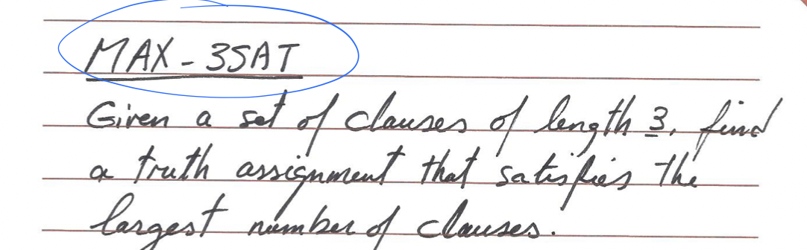
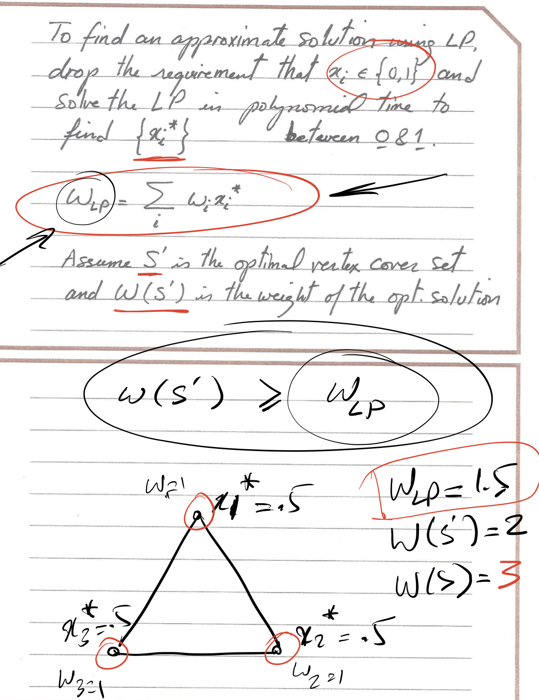

# Approximation Algorithm

- [1. Load Balancing Problem (Approximation)](#1-load-balancing-problem-approximation)
  - [1.1 Problem Statement](#11-problem-statement)
  - [1.2 General Greedy Balancing](#12-general-greedy-balancing)
  - [1.3 Improved approximation](#13-improved-approximation)
- [2.Vertex Cover Problem (2-approximation)](#2vertex-cover-problem-2-approximation)
  - [2.1 Problem Statement](#21-problem-statement)
  - [2.2 Question: Factor of 2 to get 0.5?](#22-question-factor-of-2-to-get-05)
  - [2.3 Question: Factor of 2 to get 2?](#23-question-factor-of-2-to-get-2)
- [3. MAX - 3SAT Problem](#3-max---3sat-problem)
  - [3.1 Problem Statement](#31-problem-statement)
  - [3.2 Factor of 0.5 Solution](#32-factor-of-05-solution)
- [4. Linear Programming](#4-linear-programming)
  - [4.1 System of Linear Equation](#41-system-of-linear-equation)
  - [4.2 Linear Programming (Inequality)](#42-linear-programming-inequality)
  - [4.3 Linear Programming Standard Form](#43-linear-programming-standard-form)
  - [4.4 Example](#44-example)
- [5. Weighted Vertex Cover Problem](#5-weighted-vertex-cover-problem)
  - [5.1 Problem Statement](#51-problem-statement)
  - [5.2 Integer Linear Program(NLP)](#52-integer-linear-programnlp)
  - [5.3 ILP to LP](#53-ilp-to-lp)
- [6. Maxflow Problem](#6-maxflow-problem)
- [7.Shortest Path Using LP](#7shortest-path-using-lp)

## 1. Load Balancing Problem (Approximation)

### 1.1 Problem Statement

### 1.2 General Greedy Balancing

**Ti: Load on machine i**

**T*: Value of optimal Solution**

**tj is the last job**

Based on below we can get:

j ≤ T*

Tj - ti ≤ T*

**Ti ≤ 2T***

### 1.3 Improved approximation

If the last job is the largest job, greedy will lead to the **worst case：2 times optimum**

Using approximation guarantee that result is **at most 1.5 times the optimum**.

## 2.Vertex Cover Problem (2-approximation)

### 2.1 Problem Statement

### 2.2 Question: Factor of 2 to get 0.5?

**2-approximation:** Optimum of Vertex Cover is smaller than approximation solution

**0.5-approximation:** Optimum of Independent set is smaller than approximation solution

**The answer is NO!**

### 2.3 Question: Factor of 2 to get 2?

Yes!

**2-Set Cover to find 2-Vertex Cover **

## 3. MAX - 3SAT Problem

### 3.1 Problem Statement

### 3.2 Factor of 0.5 Solution

**Set 1, if 50% is not true then just reverse to set 0**

## 4. Linear Programming

### 4.1 System of Linear Equation

**Inequality is what we need**

### 4.2 Linear Programming (Inequality)

**Maximize the Objective function subject to the above Constraints**

### 4.3 Linear Programming Standard Form

- **All Constraints are of the form ≤**

- **All variable are non-negative**

- **Objective function is maximized**

### 4.4 Example

**Simplex Method:**

**Just choose all the extreme nodes**

In mathematic, Simplex means convexon

## 5. Weighted Vertex Cover Problem

### 5.1 Problem Statement

### 5.2 Integer Linear Program(NLP)

**Not an Integer Program!**

Since xi is discrete

### 5.3 ILP to LP

Drop the xi and use x*

**S' is the Optimal vertex cover set**

**W(S') is the weight of the optimal solution**

Since we remove the constraint so the weight will improve

W(LP) ≤ W(S')

For the Set S≥0.5 , if we constrains Xi* +Xj* ≥1

**Then at least one of them will be in the S≥0.5** 

**It is enough for a vertex cover** 

**This Constrains force out Linear Program to lead to a vertex Cover**

This is a factor 2 approximation(Increase something at least 0.5 to 1)

This mean that approximation solution ≤ 2* W_LP

W_approximation ≤ 2* W_LP ≤ W_S'

## 6. Maxflow Problem

## 7.Shortest Path Using LP

